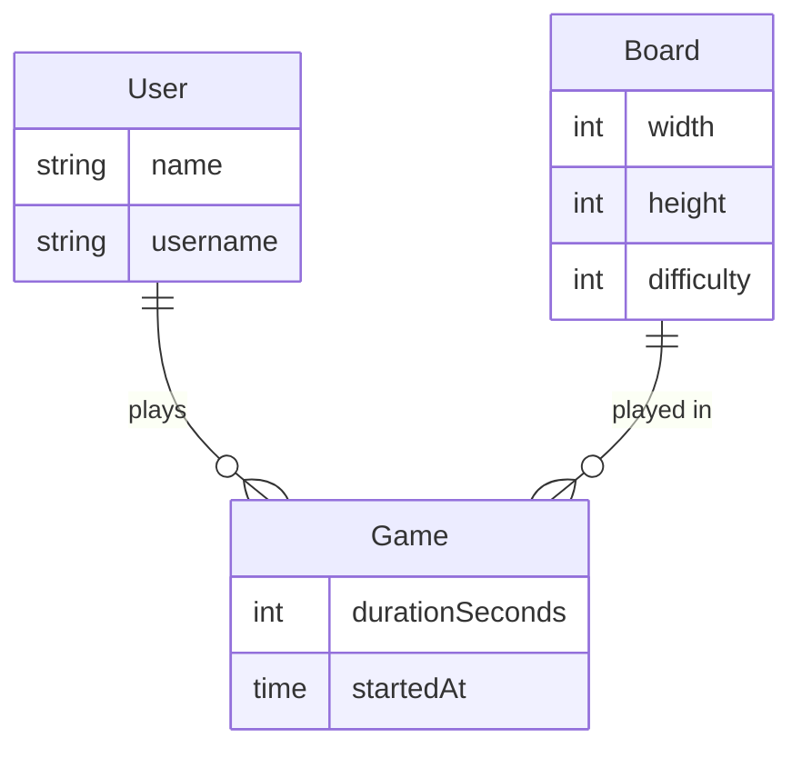

## Scaffolding a preact typescript project

```sh
npm create vite@latest mine-sweeper -- --template preact-ts

cd mine-sweeper
npm install
npm run dev
```

Install the following VSCode extensions:

1. [REST Client](https://marketplace.visualstudio.com/items?itemName=humao.rest-client)
2. [Prisma](https://marketplace.visualstudio.com/items?itemName=Prisma.prisma)

## Database model



### HTTP Clients

- `Postman`
- `Curl`
- `Wget`
- `HTTPie`
- `VSCode REST Client`

### API kinds

- `REST`
- `GraphQL`
- `gRPC`
- `SOAP`

### Start Mock API

```sh
json-server mock-backend/data.json -H 0.0.0.0
```

### Create a Fastify boilerplate app using the CLI

```sh
npm i -g fastify-cli
fastify generate minesweeper-api --lang=ts

npm i @fastify/cors
npm i prisma --save-dev

npx prisma init --datasource-provider sqlite

# Add your models and relations in schema.prisma

npx prisma migrate dev --name init

# Optional : Install SQLTools extension in VSCode. Install sqlite3 driver in SQLTools.

npx prisma studio # View, edit and test your data

```

### Benchmarking

[Golang + Fiber](./test-api/minesweeper-go/)

```
  50%    336
  66%    339
  75%    341
  80%    343
  90%    351
  95%    355
  98%    362
  99%    370
 100%    466 (longest request)
```

[Fastify + Node.js](./minesweeper-api/)

```
  50%    344
  66%    348
  75%    350
  80%    352
  90%    356
  95%    364
  98%    375
  99%    382
 100%    415 (longest request)
```
