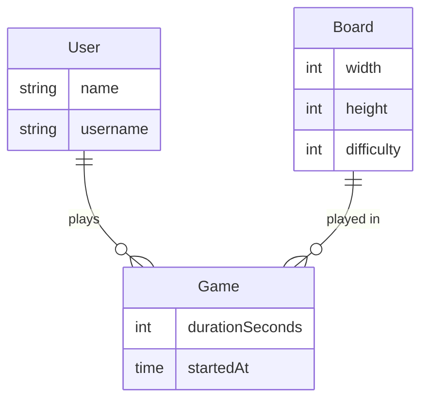

## Scaffolding a preact typescript project

```sh
npm create vite@latest mine-sweeper -- --template preact-ts

cd mine-sweeper
npm install
npm run dev
```

Install the following VSCode extensions:

1. [REST Client](https://marketplace.visualstudio.com/items?itemName=humao.rest-client)
2. [Prisma](https://marketplace.visualstudio.com/items?itemName=Prisma.prisma)

## Database model



### HTTP Clients

- `Postman`
- `Curl`
- `Wget`
- `HTTPie`
- `VSCode REST Client`

### API kinds

- `REST`
- `GraphQL`
- `gRPC`
- `SOAP`

### Start Mock API

```sh
json-server mock-backend/data.json -H 0.0.0.0
```
